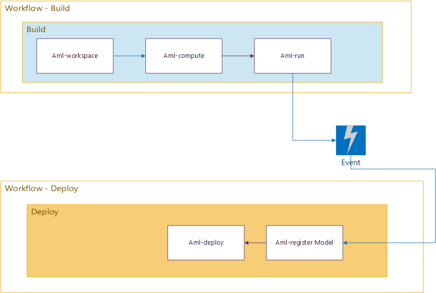
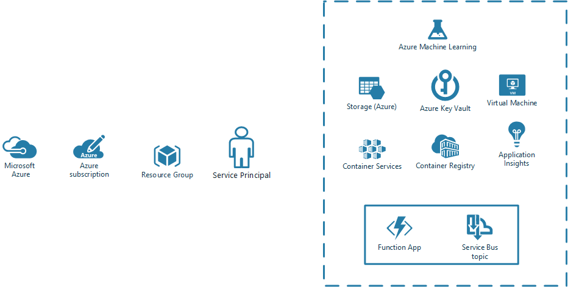
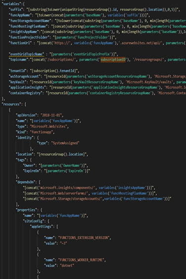
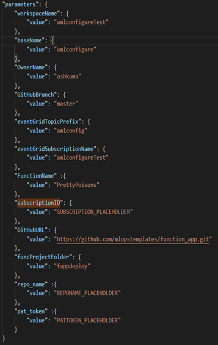
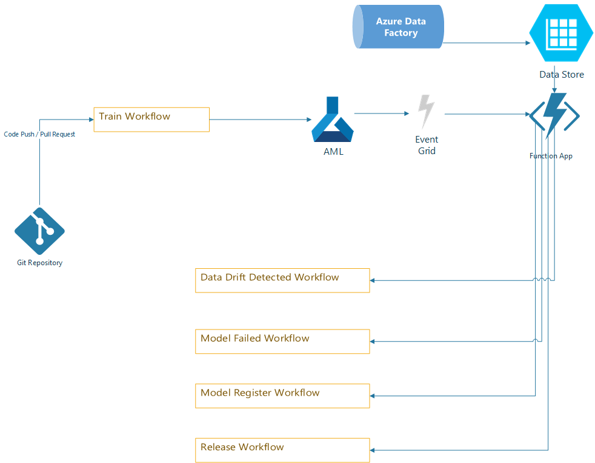

[  ]{.c41}

[]{style="overflow: hidden; display: inline-block; margin: 0.00px 0.00px; border: 0.00px solid #000000; transform: rotate(0.00rad) translateZ(0px); -webkit-transform: rotate(0.00rad) translateZ(0px); width: 621.14px; height: 11.00px;"}

[]{style="overflow: hidden; display: inline-block; margin: 0.00px 0.00px; border: 0.00px solid #000000; transform: rotate(0.00rad) translateZ(0px); -webkit-transform: rotate(0.00rad) translateZ(0px); width: 621.14px; height: 11.00px;"}[ ]{.c16 .c35} {#h.z6ne0og04bp5 .c30}
-------------------------------------------------------------------------------------------------------------------------------------------------------------------------------------------------------------------------------------------------------------------------------------------------

[]{style="overflow: hidden; display: inline-block; margin: 0.00px 0.00px; border: 0.00px solid #000000; transform: rotate(0.00rad) translateZ(0px); -webkit-transform: rotate(0.00rad) translateZ(0px); width: 620.50px; height: 413.67px;"}

[Azure Event Grid - GitHub Integration]{.c16 .c36}

[]{.c0}

[]{.c0}

[ML-Ops team GitHub India]{.c12}

[]{.c12}

[]{.c12}

[]{.c12}

[]{.c12}

[]{.c12}

[]{.c12}

[Overview]{} {#h.au51mny0sx6 .c13}
============

[Azure Machine Learning(AML) services, is an offering for the
DataScientists and Machine learning Engineers from Azure. ]{.c0}

[GitHub is a source control as a service, which allows you to also
perform CI/CD tasks using GitHub Actions and Workflows. ]{.c0}

[When machine learning code exists in GitHub and the infrastructure is
in AML. ]{.c0}

[AML along with other azure services like Storage, KeyVault, creates
different types of events which can be of interest to users to initiate
CI/CD tasks inside GitHub based on these events. ]{.c0}

[We identified one problem like this for long running machine learning
processes, where pre training and post training workflows required to be
triggered. ]{.c0}

[With the current approach of GitHub Actions present for azure machine
learning
]{}[[https://github.com/Azure/aml-template](https://www.google.com/url?q=https://github.com/Azure/aml-template&sa=D&ust=1593106646232000){.c11}]{.c18}

[Allow users to connect between AML and GitHub, but they lack
asynchronous behaviors. ]{.c0}

[For example aml-run action has to wait for training to complete if you
want to register the model or deploy the model after training. ]{.c0}

[That means the whole training-test-deploy is mostly a single workflow,
which runs almost synchronously.]{.c0}

[]{.c0}

[In this project we identified different infrastructure that can be
deployed for users along with AML , which can link together GitHub and
Azure Machine Learning.]{.c0}

[We try to deep dive into the resources and what all considerations are
kept while coming to this solution]{}

[Goals]{.c17 .c16} {#h.3at9u9s4e0vp .c13}
==================

1.  [Explain various requirements and solutions for the same]{}
2.  [Explain different components and considerations while using
    them.]{.c0}
3.  [GitHub actions take the burden off the user's head to learn azure
    machine learning SDK for various tasks so users can focus on machine
    learning rather than learning services. We indented to complement
    these action by providing event model to build and release
    process]{.c0}

[Specifications]{.c17 .c16} {#h.4p7xi5bvhxdr .c13}
===========================

[]{.c0}

[The document is intended for people with basic understanding of below
resources in Azure and GitHub. This document does not intend to describe
these services in detail as they are fairly available and enough
documentation exists for them. ]{.c0}

[This document underlines how these resources are used together or
intended to be used to provide a end to end solution for Github users
for machine learning.]{.c0}

[]{.c0}

[Azure Machine Learning Services]{.c12} {#h.56kfpodyq5td .c21}
---------------------------------------

[Azure API Management]{.c12} {#h.8i2dl4d4uqv1 .c21}
----------------------------

[Azure Functions/Function App]{.c12} {#h.clcg0a6nvql .c21}
------------------------------------

[Azure Event Grid]{.c12} {#h.mpx5qwgv1bsj .c21}
------------------------

[Azure KeyVault]{.c12} {#h.jcemwyyzcqi3 .c21}
----------------------

[Azure Resource Manager Templates]{.c12} {#h.eqcdzt55kubm .c21}
----------------------------------------

[GitHub - Workflows]{.c12} {#h.gi8dojqfb195 .c21}
--------------------------

[GitHub - Actions]{.c12} {#h.xu48o74a00mg .c21}
------------------------

[GitHub - Events]{.c12} {#h.ly6q0cspgq02 .c21}
-----------------------

[]{.c0}

[Kindly proceed after getting some basic understanding of these terms.
]{.c0}

[Milestones]{.c17 .c16} {#h.yyrhu7ml5bea .c13}
=======================

1.  [Phase 1]{} {#h.buwz1tcz7y35 style="display:inline"}
    -----------

[Understanding the ML-ops flow.]{}

2.  [Phase 2]{} {#h.p2nityf5kx5q style="display:inline"}
    -----------

[Replacing key components which the user had to create, by GitHub
Actions and Workflows. ]{.c0}

[Understanding the problem at hand in depth.]{.c0}

[]{.c0}

3.  [Phase 3]{.c12} {#h.nijay95z8a3t style="display:inline"}
    ---------------

[De-coupling Build and Release blocks of the pipeline using Azure
supported infrastructure. ]{.c0}

[]{.c0}

[]{.c0}

[]{.c0}

[[Overview](#h.au51mny0sx6){.c11}]{.c7}

[[Goals](#h.3at9u9s4e0vp){.c11}]{.c7}

[[Specifications](#h.4p7xi5bvhxdr){.c11}]{.c7}

[[Azure Machine Learning Services](#h.56kfpodyq5td){.c11}]{.c7}

[[Azure API Management](#h.8i2dl4d4uqv1){.c11}]{.c8}

[[Azure Functions/Function App](#h.clcg0a6nvql){.c11}]{.c8}

[[Azure Event Grid](#h.mpx5qwgv1bsj){.c11}]{.c8}

[[Azure KeyVault](#h.jcemwyyzcqi3){.c11}]{.c8}

[[Azure Resource Manager Templates](#h.eqcdzt55kubm){.c11}]{.c8}

[[GitHub - Workflows](#h.gi8dojqfb195){.c11}]{.c8}

[[GitHub - Actions](#h.xu48o74a00mg){.c11}]{.c8}

[[GitHub - Events](#h.ly6q0cspgq02){.c11}]{.c8}

[[Milestones](#h.yyrhu7ml5bea){.c11}]{.c7}

[[Phase 1](#h.buwz1tcz7y35){.c11}]{.c7}

[[Phase 2](#h.p2nityf5kx5q){.c11}]{.c7}

[[Phase 3](#h.nijay95z8a3t){.c11}]{.c8}

[[Current ML-Ops Flow](#h.10wqt5pi4krv){.c11}]{.c18}

[[Problem at Hand](#h.8pws0zbsw83p){.c11}]{.c8}

[[ARM Templates](#h.y3b30udc03s8){.c11}]{.c18}

[[UnderStanding Azure Function](#h.omlyg46zzi5x){.c11}]{.c8}

[[Security](#h.uti9i6hlyllv){.c11}]{.c7}

[[Create host key](#h.1voefh6eg1yn){.c11}]{.c7}

[[Retrieve host key](#h.r4zhq8di1n1b){.c11}]{.c7}

[[Azure Event Grid and GitHub Integration](#h.mbzm7wu3kgg5){.c11}]{.c8}

[]{.c0}

[]{.c0}

[]{.c0}

[Current ML-Ops Flow]{.c17 .c16} {#h.10wqt5pi4krv .c13}
================================

[]{.c0}

[The current ML-Ops flow end to end looks like the diagram below, with 3
important steps and each step is performed by a different actor. ]{.c0}

[Each step in general needs various sub actions to complete the tasks.
 It is clear that all 3 things done by a single persona are quite
overwhelming and thus need support. ]{.c0}

[]{.c0}

[]{style="overflow: hidden; display: inline-block; margin: 0.00px 0.00px; border: 0.00px solid #000000; transform: rotate(0.00rad) translateZ(0px); -webkit-transform: rotate(0.00rad) translateZ(0px); width: 624.00px; height: 354.67px;"}

[]{.c0}

[These different actions are converted into GitHub Actions and support
writing CI/CD workflows for a user in GitHub. ( some are still under
development)]{.c0}

[]{.c0}

[]{style="overflow: hidden; display: inline-block; margin: 0.00px 0.00px; border: 0.00px solid #000000; transform: rotate(0.00rad) translateZ(0px); -webkit-transform: rotate(0.00rad) translateZ(0px); width: 624.00px; height: 373.33px;"}

[]{.c0}

[List of these actions and supported templates can be found here]{.c0}

[[https://github.com/machine-learning-apps/ml-template-azure](https://www.google.com/url?q=https://github.com/machine-learning-apps/ml-template-azure&sa=D&ust=1593106646243000){.c11}]{.c18}

[[https://github.com/Azure/aml-template](https://www.google.com/url?q=https://github.com/Azure/aml-template&sa=D&ust=1593106646243000){.c11}]{.c18}

[]{.c0}

[These actions used inside GitHub Workflows comprise a single flow which
can be used to complete this cycle. ]{.c0}

[]{.c0}

[Single GitHub Workflow -
]{}[[Train-deploy.yml](https://www.google.com/url?q=https://github.com/machine-learning-apps/ml-template-azure/blob/runconfig_python/.github/workflows/train_deploy.yml&sa=D&ust=1593106646244000){.c11}]{.c18}

[]{style="overflow: hidden; display: inline-block; margin: 0.00px 0.00px; border: 0.00px solid #000000; transform: rotate(0.00rad) translateZ(0px); -webkit-transform: rotate(0.00rad) translateZ(0px); width: 629.00px; height: 906.50px;"}

[These actions help to connect to Azure Machine learning services from
GitHub workflows on behalf of users using the service principal added to
github secrets. (secrets.AZURE\_CREDENTIALS)]{.c0}

[Note : for more information please visit the above given two
repositories]{.c33 .c45}

[Problem at Hand]{.c17 .c16} {#h.8pws0zbsw83p .c13}
============================

[Current implementation doesn’t inherently support the de-coupling of
build and deploy, part. So the workflow waits till training is completed
in Azure Machine Learning. ]{.c0}

[These machine learning training can go as long as hours or days. ]{.c0}

[]{style="overflow: hidden; display: inline-block; margin: 0.00px 0.00px; border: 0.00px solid #000000; transform: rotate(0.00rad) translateZ(0px); -webkit-transform: rotate(0.00rad) translateZ(0px); width: 624.00px; height: 365.50px;"}

[If we see what we want to do is to submit the training and when
training is completed get some events and trigger the deploy part.]{.c0}

[]{.c0}

[]{.c0}

[]{style="overflow: hidden; display: inline-block; margin: 0.00px 0.00px; border: 0.00px solid #000000; transform: rotate(0.00rad) translateZ(0px); -webkit-transform: rotate(0.00rad) translateZ(0px); width: 624.00px; height: 392.50px;"}

[]{.c0}

[Events like Run Completion, Model Registered, Model Deployed and Data
Drift Detected can be captured to trigger another workflow.]{}

[But today , the two systems do not talk to each other seamlessly.
]{.c0}

[Azure Machine Learning  uses Event Grid to generate different events,
and GitHub uses a repository\_dispatch webhook to trigger a workflow
together. ]{.c0}

[Now to achieve this user has to do a lot of plumbing between two
systems, like either putting a Logic-App or Function App which can act
as a receiver and transmitter of events. ]{.c0}

[This would mean the user will have to understand a third system, and
implement the logic for that. ]{.c0}

[]{.c0}

[]{.c0}

[]{.c0}

[]{.c0}

[]{.c0}

[]{.c0}

[This means that a few resources are to be deployed and configured so
the decoupling can be achieved , but again keeping the details
abstracted from user]{.c0}

[]{.c0}

[Solution]{.c17 .c16} {#h.ayslr29z2wnl .c13}
=====================

[To achieve this, we are targeting to deploy the infrastructure, as part
of initialization, which will enable all coupling easily.]{.c1 .c16}

[These resources will be deployed the first time a user sets up his
repository or can be deployed anytime users run a workflow for
deployment. We can imagine it as a setup workflow triggered.]{.c0}

[To achieve this we targeted 3 components ]{.c0}

[1: A GitHub repository where all the code to be deployed to azure is
kept. This code essentially contains logic to receive events from Event
Grid and Send a repository dispatch event.]{.c0}

[2: A GitHub action which will be used to deploy above code for users
using the ARM templates.]{.c0}

[3: A sample Template repository to explain to users how they can use
all of this together, by giving several workflow examples.]{.c0}

[]{.c0}

[]{style="overflow: hidden; display: inline-block; margin: 0.00px 0.00px; border: 0.00px solid #000000; transform: rotate(0.00rad) translateZ(0px); -webkit-transform: rotate(0.00rad) translateZ(0px); width: 624.00px; height: 316.00px;"}

[ARM Templates ]{.c17 .c16} {#h.y3b30udc03s8 .c13}
===========================

[Azure Resource Manager templates are configurations which describe the
resources to be deployed on Azure. ARM templates are also de-facto
standard templates for enterprise solutions. ]{.c0}

[We provide already baked in ARM templates in the Sample repository,
which contains all the necessary configurations for deploying the
resources. ]{.c0}

[]{.c0}

[]{style="overflow: hidden; display: inline-block; margin: 0.00px 0.00px; border: 0.00px solid #000000; transform: rotate(0.00rad) translateZ(0px); -webkit-transform: rotate(0.00rad) translateZ(0px); width: 303.50px; height: 563.00px;"}[]{style="overflow: hidden; display: inline-block; margin: 0.00px 0.00px; border: 0.00px solid #000000; transform: rotate(0.00rad) translateZ(0px); -webkit-transform: rotate(0.00rad) translateZ(0px); width: 305.50px; height: 563.00px;"}

[Users can choose to change the configuration, by making modifications
in the parameters file, along with the templates. ]{.c0}

[]{.c0}

[Azure Function App Repository ]{.c17 .c16} {#h.xgi6emkpeg4b .c13}
===========================================

[A function repository, which contains the necessary logic to listen to
the event from Azure ML and send a repository dispatch to the GitHub
repository. ]{.c0}

[An example repository is here]{.c0}

[[https://github.com/mlopstemplates/function\_app](https://www.google.com/url?q=https://github.com/mlopstemplates/function_app&sa=D&ust=1593106646248000){.c11}]{.c18}

[It essentially contains a few Azure functions to act as a webhook,
which are registered with Azure Event Grid and receive the events from
it. ]{.c0}

[Currently the Azure functions are not very secure and follow anonymous
authentication, but the section below describes the long term
changes.]{.c33}

[UnderStanding Azure Function and Security Handling]{.c12} {#h.gxzn8rxcgbe2 .c21}
----------------------------------------------------------

[]{.c0}

[Azure
]{.c1}[[Functions](https://www.google.com/url?q=https://docs.microsoft.com/en-us/azure/azure-functions/&sa=D&ust=1593106646248000){.c11}]{.c31}[ allow
you to create microservices triggered by events, after which they run
their code, Functions are perfect for the event-driven architectures we
strive for these days. These events can come from ]{.c1}[[various
sources](https://www.google.com/url?q=https://docs.microsoft.com/en-us/azure/azure-functions/functions-triggers-bindings&sa=D&ust=1593106646249000){.c11}]{.c31}[,
like when a message is available in Service Bus, timers, an event sent
from Event Grid, etc. However, the one we still use a lot is an HTTP
trigger, where we expose the Function as a REST endpoint, available for
consumers to call into.]{.c1 .c16}

[As an architectural guideline, every REST endpoint needs to be exposed
through Azure API Management. Therefore, we intend to expose these HTTP
triggered Functions via API Management as well.  Also guidelines are
that everything is deployed as Infrastructure as Code, so we do this
through ARM templates. We dive into the security side of this, and how
to set this up in ARM.]{.c1 .c16}

### [Security]{.c28 .c16} {#h.uti9i6hlyllv .c6}

[When working with HTTP triggered Functions, there are several options
for setting up their security. These consist of having anonymous
authorization, where we don’t need to provide any API key, or using a
function or master key. Of course, we will normally not use anonymous
authorization, as we are exposing our data and processes, and as such
want to limit access to these. Consequently, when exposing our Functions
through API Management, we will create our Function App with a specific
host key for this service.]{.c1 .c16}

### [Create host key]{.c28 .c16} {#h.1voefh6eg1yn .c6}

[To create this host key, we can use the following snippet in our ARM
template for our Function App.]{.c1 .c16}

[{\
   "type": "Microsoft.Web/sites/host/functionKeys",\
   "apiVersion": "2018-11-01",\
   "name": "\[concat(parameters('functionAppName'),
'/default/apimanagement')\]",\
   "properties": {\
       "name": "api-management"\
   }\
}]{.c1 .c16 .c42}

[Since this is a host key, we place it into the ]{.c1}[default]{.c1
.c33}[ host. Alternatively, if we were creating a function key, we would
have replaced this with the Function name.]{.c1 .c16}

### [Retrieve host key]{.c28 .c16} {#h.r4zhq8di1n1b .c6}

[Now that our Function App has been deployed, we can create a Function
in it which gets exposed through API Management. In our case, we deploy
the Function App from a Git repository. ]{.c1 .c16}

[TODO: Add Snippet of arm template that does this]{.c47}[. ]{.c1 .c16}

[Next, we need to retrieve the host key of the Function App in API
Management and use this in the configuration of the
]{.c1}[[backend](https://www.google.com/url?q=https://docs.microsoft.com/en-us/azure/templates/microsoft.apimanagement/2019-01-01/service/backends&sa=D&ust=1593106646250000){.c11}]{.c31}[,
which creates a link between API Management and the Function. For this
we use the
]{.c1}[[listkeys](https://www.google.com/url?q=https://docs.microsoft.com/en-us/azure/azure-resource-manager/resource-group-template-functions-resource%23listkeys&sa=D&ust=1593106646250000){.c11}]{.c31
.c33}[function, similar to retrieving an ]{.c1}[[Azure Storage access
key](https://www.google.com/url?q=https://blog.eldert.net/retrieve-azure-storage-access-keys-in-arm-template/&sa=D&ust=1593106646251000){.c11}]{.c31}[.]{.c1
.c16}

[]{.c1 .c16}

[]{.c1 .c16}

[]{.c1 .c16}

[]{.c1 .c16}

[]{.c1 .c16}

[]{.c1 .c16}

[]{#t.ba33e131647d60a23851fb881117d5a66ea09077}[]{#t.0}

+-----------------------------------------------------------------------+
| [{\                                                                   |
|    "type": "Microsoft.ApiManagement/service/backends",\               |
|    "apiVersion": "2019-01-01",\                                       |
|    "name": "\[concat(parameters('apiManagementInstanceName'), '/',    |
| parameters('functionAppName'))\]",\                                   |
|    "dependsOn": \[\                                                   |
|        "\[resourceId('Microsoft.ApiManagement/service',               |
| parameters('apiManagementInstanceName'))\]"\                          |
|    \],\                                                               |
|    "properties": {\                                                   |
|        "url": "\[concat('https://', parameters('functionAppName'),    |
| '.azurewebsites.net/api')\]",\                                        |
|        "protocol": "http",\                                           |
|        "resourceId":                                                  |
| "\[concat('https://management.azure.com/subscriptions/',              |
| subscription().subscriptionId, '/resourceGroups/',                    |
| resourceGroup().name, '/providers/Microsoft.Web/sites/',              |
| parameters('functionAppName'))\]",\                                   |
|        "credentials": {\                                              |
|            "header": {\                                               |
|                "x-functions-key": \[\                                 |
|                    "\[listkeys(concat(variables('functionAppId'),     |
| '/host/default/'),'2016-08-01').functionKeys.apimanagement\]"\        |
|                \]\                                                    |
|            }\                                                         |
|        }\                                                             |
|    }\                                                                 |
| }]{.c1 .c16}                                                          |
+-----------------------------------------------------------------------+

[]{.c1 .c16}

[After deployment, we will find that our Function is now available via
API Management, without the need to create any secrets ourselves. ]{.c1
.c16}

[The example ARM template to deploy the resources with this post can be
found at  ]{.c1}[[GitHub
page.](https://www.google.com/url?q=https://github.com/mlopstemplates/arm_templates&sa=D&ust=1593106646252000){.c11}]{.c18
.c49}

### []{.c28 .c16} {#h.u6jltp4vq0xv .c3 .c27}

### [Function Triggers ]{.c16 .c28} {#h.jkxerd94n1xm .c3}

[We are currently registering the deployed functions to Event Grid using
ARM template as a webhook. ]{.c0}

[Moving forward we can also extend this functionality to listen to
]{}[Storage Triggers.]{.c0}

[]{.c0}

### [Standardizing the Events from Function app]{.c28 .c16} {#h.orv65ds5rrkw .c10}

[]{.c5}

[Azure Event Grid for Machine learning services today gives today
following event]{.c5}

[]{.c5}

["Microsoft.MachineLearningServices.ModelRegistered",]{.c5 .c24}

[ "Microsoft.MachineLearningServices.ModelDeployed",]{.c5 .c24}

["Microsoft.MachineLearningServices.RunCompleted",]{.c5 .c24}

[ "Microsoft.MachineLearningServices.DatasetDriftDetected",]{.c5 .c24}

[ "Microsoft.MachineLearningServices.RunStatusChanged"]{.c5 .c24}

[]{.c5}

[These event’s must be mapped properly in the client payload and
accessed via github event object ]{.c5}

[\[]{.c20}["event\_type"]{.c19}[\]
]{.c20}[=]{.c26}[ ]{.c20}["command"]{.c19}[,
\[]{.c20}["client\_payload"]{.c19}[\]
]{.c20}[=]{.c26}[ client\_payload]{.c20}

[github.event.client\_payload]{.c19}

[]{.c5}

[Thus users can write workflows based on those events.]{.c5}

[]{.c5}

[Event Mapping Standardization ]{.c5}

[Thus each event coming from Event Grid is mapped to a standard event
that will be sent as event\_type in the respository\_dispatch
request]{.c5}

[These events are documented into the repository and also present as an
output of the resource deployment.]{.c5}

[[https://github.com/mlopstemplates/function\_app/blob/master/README.md](https://www.google.com/url?q=https://github.com/mlopstemplates/function_app/blob/master/README.md&sa=D&ust=1593106646254000){.c11}]{.c18}

[]{.c0}

[]{.c0}

[Using Template Engine ]{.c0}

[We are also investigating the part where incoming schema can be
converted to repository dispatch schema automatically for all the event
types.]{.c0}

### [Registering with Azure Event Grid]{.c28 .c16} {#h.oq9hi19ffdao .c3}

[These functions need to get registered with Event Grid, this is done by
adding these functions as webhook. ]{.c0}

[The incoming webhook request follows the event grid schema and provides
the necessary information to function to create the payload for Github
Repository Dispatch. ]{.c0}

[]{.c0}

[Template Repository ]{.c16 .c17} {#h.1mc88dmidyd4 .c13}
=================================

[The template repository contains below workflows, which act as an
example for users to start with]{}

[[https://github.com/mlopstemplates/aml\_infra](https://www.google.com/url?q=https://github.com/mlopstemplates/aml_infra&sa=D&ust=1593106646255000){.c11}]{.c15}

[]{.c5}

1.  [Deploy\_infra.yml : this workflow deploys all the resources using
    the ARM templates and Github Action. ]{.c5}
2.  [Train.yml : this workflow triggers when change in the training code
    is observed]{.c5}
3.  [Deploy.yml : this workflow triggers on repository dispatch even
    coming from azure function]{.c40}

[]{.c5}

[]{style="overflow: hidden; display: inline-block; margin: 0.00px 0.00px; border: 0.00px solid #000000; transform: rotate(0.00rad) translateZ(0px); -webkit-transform: rotate(0.00rad) translateZ(0px); width: 403.00px; height: 400.50px;"}

[]{.c5}

[]{.c5}

[]{.c5}

[]{.c5}

[]{.c5}

[Finally this is how the top level system looks like. User is free to
write the workflow based on the events as he wishes to.]{.c5}

[]{style="overflow: hidden; display: inline-block; margin: 0.00px 0.00px; border: 0.00px solid #000000; transform: rotate(0.00rad) translateZ(0px); -webkit-transform: rotate(0.00rad) translateZ(0px); width: 624.00px; height: 485.33px;"}

[]{.c5}

[]{.c5}

[]{.c5}

[]{.c5}

[]{.c0}

[]{.c0}
